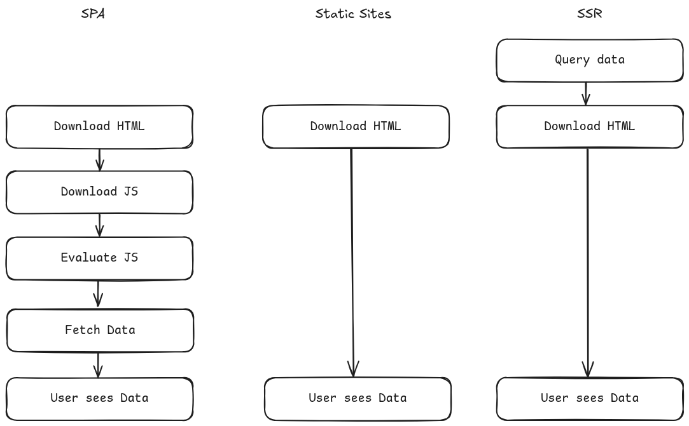

# SSR talk

- As a backend engineer only writing json APIs I had to relearn what classical
    web development is
  - Colleague: this feature is just a form. Me:??
- History recap
  - HTML / Web 1.0
    - knows only POST and GET
    - All logic on the server
    - Browser is just a client
    - PHP is perfect fit here
  - Ajax / jQuery era: Javascript führt requests aus. XML + JSON skyrocket
  - SPA era: Angular + React
    - Coincided with rise of Apple + Android
    - server serves JSON-data-API
    - Mobile clients and Web client in parallel
  - Next.js era: SPA hangover: websites are MBs of download. React alone doesn't
      cut it. You need react-router, react-query, react-forms. You need tooling
      for styles, usually Tailwind. Waterfalls are slow.
- GET & DELETE requests will include values via query parameters, other request
  types will submit them as a form encoded body.
- React SPAs were the default for a long time but recently I felt a new wave of
  SSR momentum
- SSR
  - Post redirect get
- SPA + JSON API
  - CDN for App
  - API for data
- SPA hangover
  - [Page Weight continuously
    rising](https://almanac.httparchive.org/en/2025/page-weight#page-weight-over-time) 
  - [What is causing Page
    Weight](https://almanac.httparchive.org/en/2025/page-weight#median-page-by-the-bytes)
    
  - [JS bytes !== img
    bytes](https://web.dev/articles/reduce-javascript-payloads-with-tree-shaking) 
  - [The performance gap between flagship and budget phones keeps
    increasing](https://infrequently.org/2024/01/performance-inequality-gap-2024/)
    
  - 
- REST + HATEOAS
- Out of order [streaming HTML](https://go-streaming-html-ooo.fly.dev/)
- Htmx
  - Why should only `<a>` & `<form>` be able to make HTTP requests?
  - Why should only click & submit events trigger them?
  - Why should only GET & POST methods be available?
  - Why should you only be able to replace the entire screen?
- Alpine.js
- Inertia.js

## Sources

- [MPAs vs SPAs](https://www.youtube.com/watch?v=iOqPj-CjoV0) - Ryan Carniato 5h
  stream
  - There was a time where the entire page state was serialized to the POST body
    to have the page look the same after sending back the response
- [Islands, Partial Hydration, & JavaScript
  Frameworks](https://www.youtube.com/watch?v=Q0mXYbA86Qo) - Ryan Carniato 3h
  stream
  - Interactivity of Airbnb search bar sucks in SSR
    - also cascading dropdown - think country, city
  - .NET solves it with fetchable partials (transfers new HTML instead of data)
    - Rails Turbo, HTMX kinda does this
- [Keynote: Why web tech is like this - Steve Sanderson - NDC London
  2023](https://www.youtube.com/watch?v=2buWVsQ7stk)
  - Google Maps als SSR Kacke
